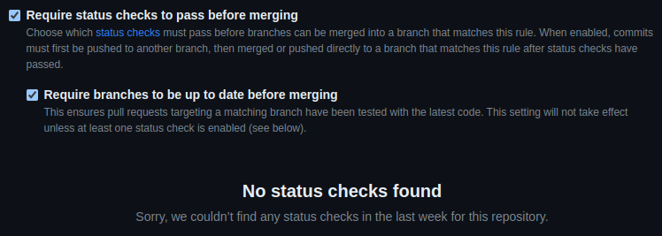
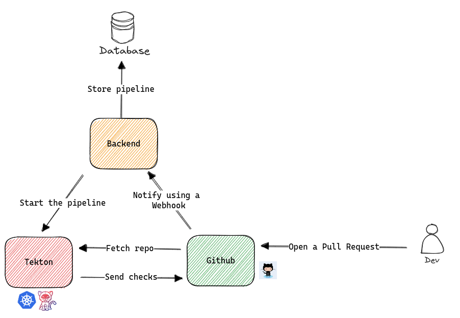
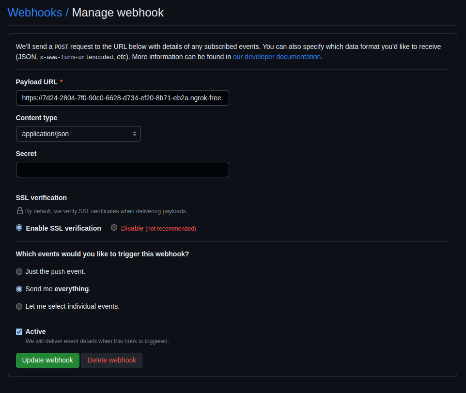
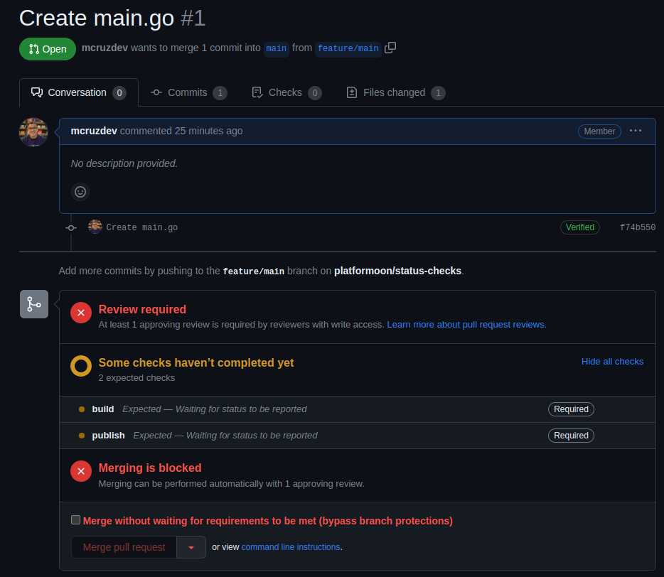

# Adding checks on Github Pull Requests

In this tutorial we will add checks for a Github pull request.

## Github Branch Protection

First of all, we need to make sure we have configured branch protection for our repositories correctly, so that developers do not deliver poor quality code to production.



This can be configured when we create an application through our applications that communicate with Github directly, here is an [example of code that does this](https://raw.githubusercontent.com/mcruzdev/platformoon-apps/main/src/main/java/com/github/platformoon/infra/application/GithubRepository.java).

We will have just two status checks, `build` and `publish`.

## Knowing the basic flow

Basically the following image represents the flow that we will use.



If you are familiar with Java code and QUarkus see the following code to [follow the flow inside the application](https://raw.githubusercontent.com/mcruzdev/platformoon-apps/main/src/main/java/com/github/platformoon/presentation/resources/GithubWebhookResource.java).

???+ info "TIP: Using ngrok to listen Github Webhooks"

    If you want, you can use ngrok to listen the Github Webhook for dev environments.

    1. Start the infrastructure using `docker-compose up -d docker-compose.yaml`.
    2. Start the Quarkus application using `quarkus dev`.
    3. Expose the Quarkus application to the world using `ngrok http 8080`.

## Configuring Webhook for Organization

To configure the webhook you need to access `https://github.com/organizations/[organization]/settings/hooks` and click on `Add webhook`. The following image represents the basic configuration that you can use to configure a webhook.

We will listen for all events, but is recommended to select just the necessary events for you use case and add a Secret key to secure the application (allowing just request that contains the secret) that will receive the webhook.



## Creating a Pull Request

Let's create a simple pull request on Github.

Add the following code to the `main.go` file.

```go
package main

func main() {
}
```

After, you can see that your pull request looks like the following image:



### Why?

Since our pull request already has the required checks before merging, we now need to update those checks to verify if the build and publish steps are okay. To do this, we need to send the statuses of each one to GitHub.


## Adding a new Task on Tekton

We are using Tekton to facilitate our life. Let's utilize a Task created by the community called **github-set-status**, responsible for sending the status to GitHub.

### Adding the Task resource to the cluster

```bash
kubectl apply -f https://api.hub.tekton.dev/v1/resource/tekton/task/github-set-status/0.3/raw
```

See [here](https://hub.tekton.dev/tekton/task/github-set-status), more information about this Tekton Task.

### Creating a secret to store Github token

The following code, can be found [here](/).
```yaml
apiVersion: v1
data:
  token: {{ .Values.apps.secrets.ghToken }}
kind: Secret
metadata:
  name: github
```